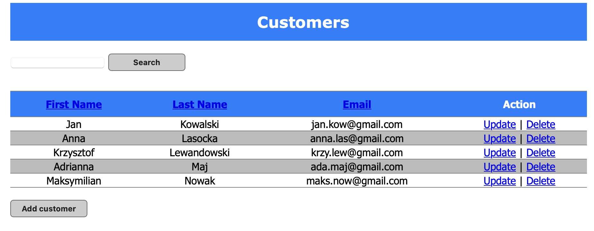
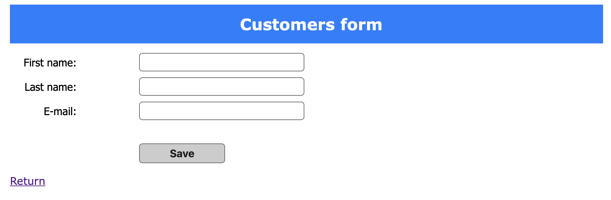
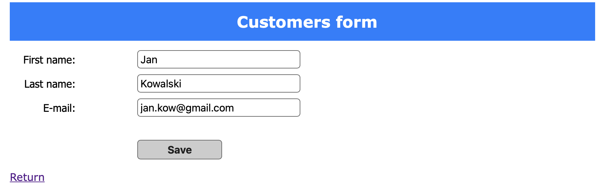
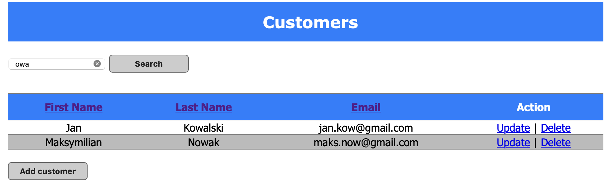
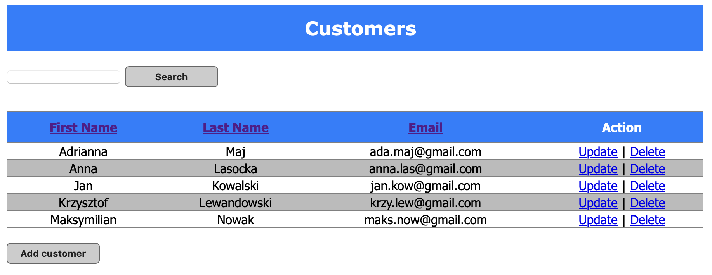
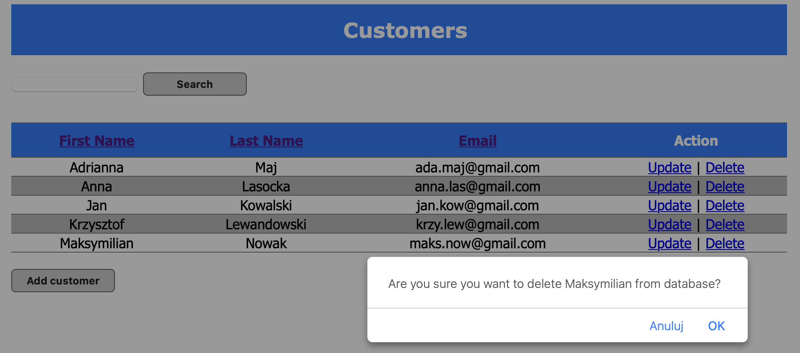

# Customer Data Management System

This is a simple CRUD Spring MVC application, created mainly for educational purposes. It's based on Spring MVC, Hibernate and MySQL - using Maven and XML configuration.

### Functionality
- Connect via SQL database
- CRUD operations for list of Customers
- Searching based on first name, last name and email
- Sorting based on first name, last name and email
- Using DAO and Service layer principles

---

## Running service

#### Home page

#### Adding Customer

#### Updating Customer

#### Searching (for example: contains 'owa')

#### Sorting (for example: by first name)

#### Deleting Customer

